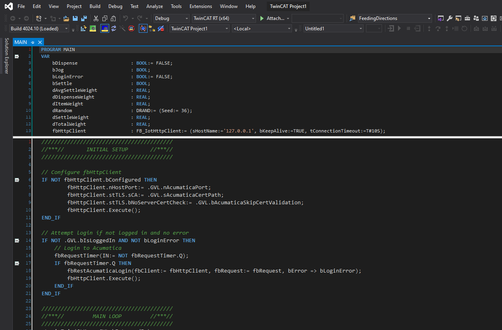

# TwinCATDarkMode

> :warning: I am not responsible for anything that happens as a result of you **following** OR ***not following*** the instructions below!

> There are reports of unexplained VS crashes, possibly due to changes made here. See the warning above!

> The upper editor in online view will remain white. This is a known issue for which I have no solution currently.

## Instructions

1. Get the files
    1. Download the ``TwinCAT_DarkMode.zip`` file and extract *somewhere*
    1. Close any running instances of Visual Studio
    1. Copy the ``TwinCAT`` folder that is extracted and paste into the parent folder of your TwinCAT installation directory. For example, if TwinCAT is installed in ``C:\``, copy the extracted ``TwinCAT`` folder to ``C:\``.  This will cause Windows to ask if you would like to replace several files. Click **Replace the files in the destination**. This will also copy backup files, so you should not NEED to backup, but _IF YOU DON'T_, see the warning at the top of this page.
1. Import the settings (will only affect a couple TwinCAT options)
    1. Start Visual Studio
    1. Open the ``Tools`` > ``Import and Export Settings...`` menu
    1. Select the **Import selected environment settings** and click *Next*
    1. Import settings 
        - Choose to save your current settings **OR**
        -   choose not to save your current settings (see warning at top of page)
        - Click *Next*
    1. Click *Browse*
    1. Find and open either
        - the ``VS_DarkModeColors.vssettings`` for the Visual Studio integration **OR**
        -   the ``XAE_DarkModeColors.vssettings`` for the XAE shell
    3. Click *Next* and then *Finish*

If you receive the error 'Cannot start PLC' or something similar, you can try navigating to *root*\TwinCAT\3.1\Components\Plc\LacBinaries\GAC_MSIL
Under the following folders, there will be a secondary file with the extension ``*.dll.modd`` which you can rename to ``*.dll`` to replace currently active library.
- ControlsContrib
- PInvoke
- Utilities

This is not a guaranteed fix.

Since this project is taking up a lot of time and seems to be fraught with hangups and gotchas, I will no longer be supporting it. You can find the original post here: https://www.reddit.com/r/PLC/comments/hudl9k/finally_made_a_proper_dark_theme_for_a_plc_editor/ (it is not mine).

## Preview

